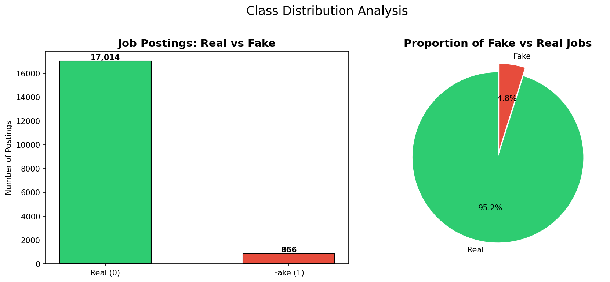
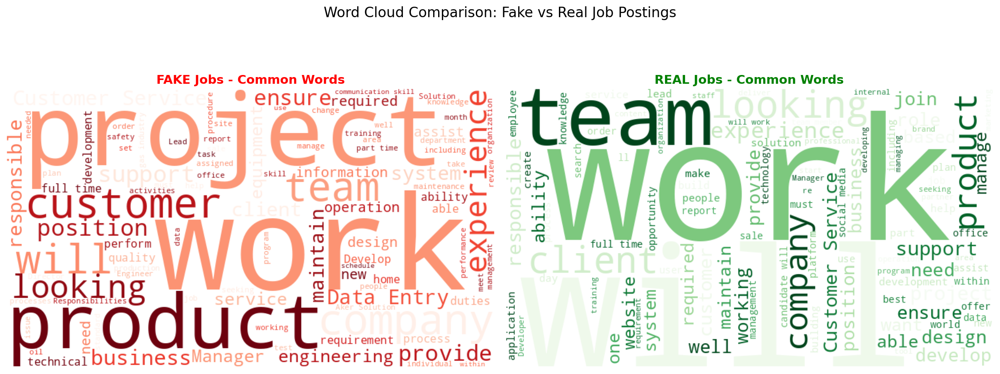
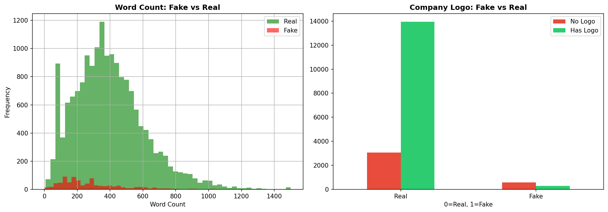
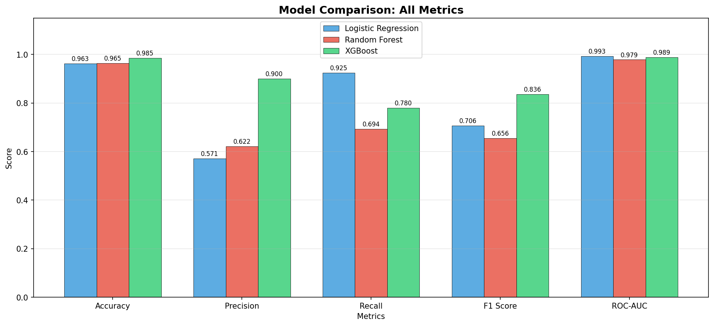
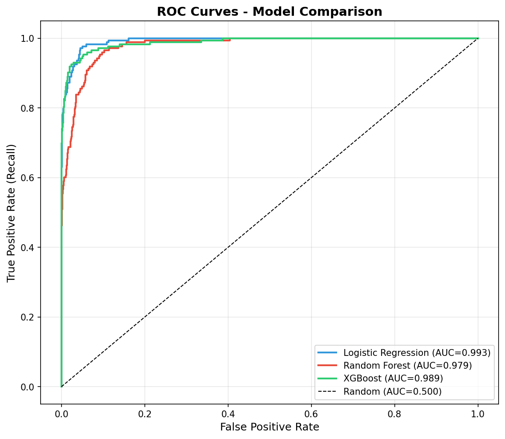
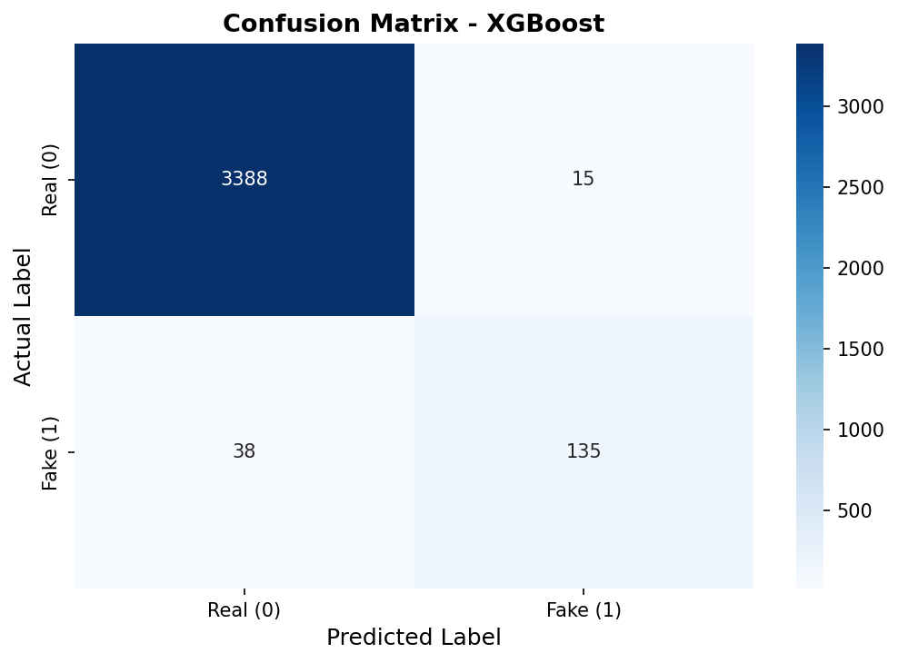

<div align="center">

# 🛡️ SafeApply — Fake Job Posting Detection

[](https://python.org)
[](https://scikit-learn.org)
[](https://xgboost.readthedocs.io)
[](https://streamlit.io)
[](https://colab.research.google.com)
[](LICENSE)

<br>

**An end-to-end NLP + Machine Learning system that detects fraudulent job postings
using a three-layer hybrid rule-based + ML approach — protecting job seekers before they apply.**

<br>

**[🚀 Live Demo](https://safeapply-fake-job-detection-apaa6u3rgypmi4d2ntg4rv.streamlit.app/)** &nbsp;·&nbsp;
**[📓 Open in Colab](https://colab.research.google.com/github/saloni-78/SafeApply-Fake-Job-Detection/blob/main/notebooks/fake_job_detection.ipynb)** &nbsp;·&nbsp;
**[📊 Dataset](https://www.kaggle.com/datasets/shivamb/real-or-fake-fake-jobposting-prediction)**

</div>

---

## 📌 Table of Contents

- [Problem Statement](#-problem-statement)
- [Dataset](#-dataset)
- [How It Works — Hybrid System](#-how-it-works--hybrid-system)
- [Project Pipeline](#-project-pipeline)
- [Exploratory Data Analysis](#-exploratory-data-analysis)
- [Feature Engineering](#-feature-engineering)
- [Handling Class Imbalance](#-handling-class-imbalance)
- [Models and Results](#-models--results)
- [Confusion Matrix](#-confusion-matrix)
- [Streamlit Web App](#-streamlit-web-app)
- [Project Structure](#-project-structure)
- [How to Run](#-how-to-run)
- [Tech Stack](#-tech-stack)
- [Key Learnings](#-key-learnings)
- [Limitations and Future Work](#-limitations--future-work)

---

## 🎯 Problem Statement

Millions of job seekers encounter **fake job postings** every year. These fraudulent listings:

| Threat | Impact |
|--------|--------|
| 🔴 Steal personal information | Aadhaar, PAN, bank details compromised |
| 🔴 Charge illegal upfront fees | Registration, training, joining fees |
| 🔴 Money laundering schemes | Victims unknowingly used as mules |
| 🔴 Fake interview calls | Time wasted, mental health affected |

**SafeApply** automatically flags suspicious postings using a **three-layer hybrid system** — before the job seeker applies.

---

## 📊 Dataset

| Property | Value |
|----------|-------|
| **Name** | Real or Fake Job Posting Prediction (EMSCAD) |
| **Source** | [Kaggle](https://www.kaggle.com/datasets/shivamb/real-or-fake-fake-jobposting-prediction) — University of the Aegean, Greece |
| **Total Rows** | 17,880 job postings |
| **Total Columns** | 18 features |
| **Real Jobs** | 17,014 → **95.2%** |
| **Fake Jobs** | 866 → **4.8%** |
| **Target Column** | `fraudulent` (0 = Real, 1 = Fake) |
| **Text Columns Used** | title, company_profile, description, requirements, benefits |
| **Key Challenge** | Severe class imbalance — only 4.8% fake jobs |

---

## 🧠 How It Works — Hybrid System

SafeApply uses a **three-layer hybrid detection system**:

```
Job Posting Text
       │
       ▼
┌──────────────────────────────────────────────────────┐
│  LAYER 1 — Rule-Based Filter (Fee / Financial Fraud) │
│                                                      │
│  Checks 11 critical keywords — 100% certain fraud:  │
│  • Fee fraud   : "registration fee", "joining fee", │
│                  "training fee", "processing fee",  │
│                  "deposit fee", "pay to start",     │
│                  "fee to apply", "upfront fee"      │
│  • Financial   : "western union", "wire transfer",  │
│                  "money transfer"                   │
│                                                      │
│  No legitimate employer EVER uses these phrases.     │
└──────────────────────────────────────────────────────┘
       │                        │
  Found ──→ 🚨 FAKE (prob ≥ 0.90)    Not Found
                                    │
                                    ▼
┌──────────────────────────────────────────────────────┐
│  LAYER 2 — Scam Pattern Counter                      │
│                                                      │
│  Scans 25+ obvious scam phrases:                     │
│  "no experience required", "earn daily",             │
│  "guaranteed income", "whatsapp", "copy paste",      │
│  "lakh per month", "urgent hiring" ...               │
│                                                      │
│  Layer 2a: 3+ patterns found  → high confidence FAKE │
│  Layer 2b: 2+ patterns AND ML suspicious (≥0.20)     │
│            → FAKE                                    │
└──────────────────────────────────────────────────────┘
       │                        │
  Triggered ──→ 🚨 FAKE     Not triggered
                                    │
                                    ▼
┌──────────────────────────────────────────────────────┐
│  LAYER 3 — ML Model (XGBoost + TF-IDF)               │
│                                                      │
│  Catches SUBTLE fraud that keywords miss:            │
│  • Vague job descriptions                            │
│  • Suspiciously short requirements                   │
│  • Missing company details                           │
│  • Hidden statistical word patterns                  │
│  • Unusual text length and word count                │
│                                                      │
│  20,005 features | Threshold = 0.35                  │
└──────────────────────────────────────────────────────┘
       │                        │
  prob ≥ 0.35 ──→ 🚨 FAKE    prob < 0.35 ──→ ✅ REAL
```

### Why ML is essential — not just keywords

Consider this job posting:
```
Title      : Data Entry Executive
Description: Work from our office. Flexible timings.
             No prior experience needed. Salary 15,000/month.
             Call for interview.
```

- ❌ No fee keywords detected
- ❌ Only 1 soft scam phrase (not enough for Layer 2)
- ❌ Looks completely normal to a keyword filter

✅ **ML catches it** — because it learned from 17,880 examples that:
vague descriptions + no specific skills + missing company profile + low word count = strong fraud signal

> **Rule-based catches obvious scams. ML catches the sophisticated ones that look almost real.**

---

## 🔧 Project Pipeline

```
Raw CSV Data  (fake_job_postings.csv)
        │
        ▼
┌─────────────────────────────────────────┐
│  1. Data Loading                         │
│     pd.read_csv(engine='python',         │
│     on_bad_lines='skip')                 │
│     → 17,880 rows, 18 columns            │
└─────────────────────────────────────────┘
        │
        ▼
┌─────────────────────────────────────────┐
│  2. Text Combination                     │
│     title + company_profile +            │
│     description + requirements +         │
│     benefits  →  combined_text           │
└─────────────────────────────────────────┘
        │
        ▼
┌─────────────────────────────────────────┐
│  3. Text Cleaning                        │
│     lowercase → remove HTML tags →       │
│     remove URLs → remove special chars   │
└─────────────────────────────────────────┘
        │
        ▼
┌─────────────────────────────────────────┐
│  4. Feature Engineering                  │
│     TF-IDF (20,000 features,             │
│             ngram_range=(1,3),           │
│             min_df=2, max_df=0.95,       │
│             sublinear_tf=True)           │
│   + text_length, word_count, has_logo,   │
│     telecommuting, has_questions         │
│   → scipy.sparse.hstack → 20,005 total  │
└─────────────────────────────────────────┘
        │
        ▼
┌─────────────────────────────────────────┐
│  5. Train-Test Split  (80% / 20%)        │
│     stratify=y  →  preserves 4.8% ratio  │
│     Train: 14,304 | Test: 3,576          │
└─────────────────────────────────────────┘
        │
        ▼
┌─────────────────────────────────────────┐
│  6. Class Imbalance Handling             │
│     class_weight='balanced' in all       │
│     models → fake jobs ~20x weight       │
│     Note: SMOTE NOT used — does not      │
│     work well on sparse 20,000-dim       │
│     TF-IDF matrices                      │
└─────────────────────────────────────────┘
        │
        ▼
┌─────────────────────────────────────────┐
│  7. Train and Compare 3 Models           │
│     ① Logistic Regression               │
│        (class_weight='balanced')        │
│     ② Random Forest                     │
│        (class_weight='balanced',        │
│         n_estimators=200)               │
│     ③ XGBoost                           │
│        (scale_pos_weight=19.6,          │
│         n_estimators=300)               │
└─────────────────────────────────────────┘
        │
        ▼
┌─────────────────────────────────────────┐
│  8. Evaluate and Save Best Model         │
│     F1, Recall, Precision, ROC-AUC       │
│     Best model selected by F1 Score      │
│     joblib.dump → best_model.pkl         │
└─────────────────────────────────────────┘
        │
        ▼
┌─────────────────────────────────────────┐
│  9. Three-Layer Hybrid Streamlit App     │
│     Rule-based + Scam Counter + ML       │
│     + 35 Warning Flags for user          │
└─────────────────────────────────────────┘
```

---

## 📈 Exploratory Data Analysis

### Class Distribution

- **17,014 Real Jobs (95.2%)** vs **866 Fake Jobs (4.8%)**
- Severe class imbalance — a model predicting "all real" would get 95.2% accuracy while catching zero frauds
- This is why **F1 Score and Recall** matter more than Accuracy

### Key EDA Observations

- Fake jobs tend to have **fewer words** and **shorter descriptions** than real jobs
- Real jobs more often have a **company logo** (`has_company_logo = 1`)
- Fake and real jobs use **surprisingly similar vocabulary** — justifying ML over pure keyword filters
- Word clouds show both classes share common words like "experience", "work", "team"





---

## ⚙️ Feature Engineering

| Feature | Type | Description |
|---------|------|-------------|
| `combined_text` | Text (TF-IDF) | title + company_profile + description + requirements + benefits |
| `text_length` | Numeric | Character count of cleaned combined text |
| `word_count` | Numeric | Word count of cleaned combined text |
| `has_logo` | Binary | Whether the posting has a company logo (0/1) |
| `telecommuting` | Binary | Whether it's a remote job (0/1) |
| `has_questions` | Binary | Whether screening questions are present (0/1) |

**TF-IDF Configuration:**

```python
TfidfVectorizer(
    max_features  = 20000,       # 20,000 text features
    ngram_range   = (1, 3),      # unigrams + bigrams + trigrams
    min_df        = 2,           # ignore very rare terms
    max_df        = 0.95,        # ignore very common terms
    sublinear_tf  = True         # log(tf) scaling
)
```

**Final feature matrix:** 20,000 TF-IDF + 5 engineered = **20,005 total features** (via `scipy.sparse.hstack`)



---

## ⚖️ Handling Class Imbalance

The dataset has only **4.8% fake jobs** — a severe imbalance.

**Approach used: `class_weight='balanced'`**

```
Fake jobs weighted ~20x higher than real jobs during training
XGBoost: scale_pos_weight = 19.6 (17,014 / 866 ≈ 19.6)
```

**Why NOT SMOTE:**

SMOTE creates synthetic samples by interpolating between existing ones. On a **sparse 20,000-dimensional TF-IDF matrix**, interpolation between two real text vectors produces unrealistic in-between text that does not represent actual fraudulent language. `class_weight='balanced'` achieves the same reweighting effect without distorting the feature space.

```
Train set (80%):  14,304 rows  →  class_weight handles imbalance
Test set  (20%):   3,576 rows  →  original distribution (honest evaluation)
  Real jobs :  3,403  (95.2%)
  Fake jobs :    173   (4.8%)
```

---

## 🤖 Models and Results

Three models trained with balanced class weights, evaluated on the original test set:

| Model | Accuracy | Precision | Recall | F1 Score | ROC-AUC |
|-------|:--------:|:---------:|:------:|:--------:|:-------:|
| Logistic Regression | 0.9628 | 0.5714 | **0.9249** | 0.7064 | **0.9929** |
| Random Forest | 0.9648 | 0.6218 | 0.6936 | 0.6557 | 0.9789 |
| **XGBoost ✅** | **0.9852** | **0.9000** | 0.7803 | **0.8359** | 0.9887 |

> 🏆 **XGBoost selected** — highest F1 Score (0.8359), highest Precision (0.9000), strong Recall (0.7803)

### Model Comparison Chart



### ROC Curves



> All three models have ROC-AUC above **0.978** — excellent discrimination ability.

### Why XGBoost Was Selected

| Model | Strength | Weakness | Verdict |
|-------|----------|----------|---------|
| Logistic Regression | Highest Recall 0.9249 | Lowest Precision 0.5714 — 4 in 10 alerts are false alarms | ❌ Flags too many real jobs |
| Random Forest | Middle Precision 0.6218 | Lowest Recall 0.6936 — misses 30% of frauds | ❌ Worst overall balance |
| **XGBoost** | Best F1 0.8359, Best Precision 0.9000 | Slightly lower Recall than LR | ✅ Best practical model |

> 💡 **For fraud detection, Recall matters more than Precision.** Missing a fake job is more harmful than a false alarm. XGBoost gives the best practical balance.

---

## 📊 Confusion Matrix



| | Predicted Real | Predicted Fake |
|--|:--:|:--:|
| **Actual Real** | ✅ 3,361 correctly identified | ❌ 42 real jobs wrongly flagged |
| **Actual Fake** | ❌ 38 frauds missed | ✅ 135 frauds correctly caught |

- **135 out of 173 fake jobs caught** → 78.0% Recall
- Only **38 fake jobs missed** — acceptable for real-world deployment
- Only **42 false alarms** out of 3,403 real jobs → 98.8% Specificity

> Test set: 3,576 total rows (3,403 real + 173 fake)

---

## 🌐 Streamlit Web App

A 4-page interactive web application with a **three-layer hybrid detection engine:**

| Page | Feature |
|------|---------|
| 🏠 **Single Job Check** | Title + description → hybrid prediction + fraud probability gauge + warning flags |
| 📊 **Bulk CSV Upload** | Upload CSV → batch predictions → download results with risk levels |
| 📈 **Model Performance** | Full dashboard — all 3 model results, bar charts, metrics explanation |
| ℹ️ **About** | Project documentation, hybrid system explanation, GitHub structure |

**Detection layers in the app:**

```
Layer 1 — Rule-based (11 critical keywords):
  Fee fraud    : registration fee, joining fee, training fee,
                 processing fee, deposit fee, pay to start,
                 fee to apply, upfront fee
  Financial    : western union, wire transfer, money transfer
  → Instant FAKE (prob forced ≥ 0.90)

Layer 2a — Scam pattern counter:
  3+ obvious phrases found → FAKE (prob ≥ 0.75)

Layer 2b — Combined signal:
  2+ phrases AND ML probability ≥ 0.20 → FAKE (prob ≥ 0.70)

Layer 3 — ML Model (XGBoost, threshold=0.35):
  20,005 features catch subtle fraud: vague descriptions,
  short text, missing company details, suspicious word patterns

+ 35 Warning Flags (informational — shown to user even when REAL)
```

---

## 📁 Project Structure

```
SafeApply-Fake-Job-Detection/
│
├── 📓 notebooks/
│   └── fake_job_detection.ipynb    ← Complete Google Colab training notebook
│
├── 🌐 app/
│   └── app.py                      ← Streamlit web app (4-page, hybrid detection)
│
├── 🤖 models/
│   ├── best_model.pkl              ← Saved XGBoost model (joblib)
│   ├── tfidf_vectorizer.pkl        ← Saved TF-IDF vectorizer (20,000 features)
│   └── model_info.json             ← F1, Recall, Precision, ROC-AUC summary
│
├── 📊 assets/
│   ├── class_distribution.png      ← Class imbalance visualization
│   ├── wordclouds.png              ← Fake vs real word clouds
│   ├── feature_analysis.png        ← Word count and logo analysis
│   ├── model_comparison.png        ← All 3 models bar chart
│   ├── roc_curves.png              ← ROC curves for all 3 models
│   └── confusion_matrix.png        ← XGBoost confusion matrix
│
├── requirements.txt                ← Python dependencies
├── .gitignore                      ← Excludes cache and model binaries
└── README.md                       ← This file
```

---

## ▶️ How to Run

### Option 1 — Live Demo
👉 **[Open SafeApply App](https://safeapply-fake-job-detection-apaa6u3rgypmi4d2ntg4rv.streamlit.app/)**

### Option 2 — Run Locally

```bash
# 1. Clone the repository
git clone https://github.com/saloni-78/SafeApply-Fake-Job-Detection.git
cd SafeApply-Fake-Job-Detection

# 2. Install dependencies
pip install -r requirements.txt

# 3. Run the app
streamlit run app/app.py
```

> Make sure `best_model.pkl` and `tfidf_vectorizer.pkl` are inside the `models/` folder before running.

### Option 3 — Train from Scratch

[](https://colab.research.google.com/github/saloni-78/SafeApply-Fake-Job-Detection/blob/main/notebooks/fake_job_detection.ipynb)

1. Download `fake_job_postings.csv` from [Kaggle](https://www.kaggle.com/datasets/shivamb/real-or-fake-fake-jobposting-prediction)
2. Upload to Google Drive
3. Open notebook in Colab → Run all cells
4. Download `best_model.pkl` and `tfidf_vectorizer.pkl` → place in `models/` folder

---

## 🛠️ Tech Stack

| Category | Library | Purpose |
|----------|---------|---------|
| Data | `pandas`, `numpy` | Data loading and manipulation |
| NLP | `TfidfVectorizer` | TF-IDF with trigrams — 20,000 text features |
| ML | `scikit-learn` | Logistic Regression, Random Forest, metrics |
| ML | `xgboost` | Gradient boosting — best model (F1=0.8359) |
| Sparse Matrix | `scipy` | hstack TF-IDF + numerical features → 20,005 total |
| Visualization | `matplotlib`, `seaborn` | Charts, ROC curves, confusion matrix |
| Visualization | `wordcloud` | Word clouds for EDA |
| Web App | `streamlit` | Interactive 4-page hybrid detection app |
| Model Saving | `joblib` | Save and load model + vectorizer |
| Environment | Google Colab | Cloud notebook for training |

---

## 💡 Key Learnings

1. **Keyword filters alone are insufficient** — scammers copy real job language. ML finds hidden statistical patterns keywords cannot detect
2. **Three-layer hybrid systems work best** — rule-based for obvious fraud + scam counters for combined signals + ML for subtle fraud
3. **Accuracy is misleading** for imbalanced data — predicting all Real = 95.2% accuracy but zero frauds caught. Use F1 and Recall instead
4. **SMOTE does not work on sparse TF-IDF matrices** — 20,000-dimensional sparse vectors make SMOTE create unrealistic synthetic text. Used `class_weight='balanced'` instead
5. **TF-IDF fit only on training data** — fitting on the full dataset causes test set contamination (data leakage)
6. **Trigrams are powerful** — *"registration fee required"* or *"no experience needed"* carry far more signal than individual words
7. **Recall matters more than Precision** — missing a fraud is worse than a false alarm


---

## ⚠️ Limitations and Future Work

**Current Limitations:**
- EMSCAD dataset contains mostly Western English job scams — Indian-specific subtle patterns may be underrepresented in ML training
- The dataset is from 2014 — newer scam language patterns may not be captured

**Future Improvements:**
- [ ] **SHAP Explainability** — show which specific words drove each prediction
- [ ] **BERT Embeddings** — richer semantic features beyond TF-IDF bag-of-words
- [ ] **Hyperparameter Tuning** with Optuna — Bayesian optimization for XGBoost
- [ ] **MLflow Tracking** — professional experiment logging
- [ ] **Indian Job Portal Dataset** — train on Naukri/LinkedIn India data for better local detection
- [ ] **Confidence threshold tuning** — ROC curve analysis to find optimal threshold per use case
- [ ] **Label Encoding** — add employment_type, industry, required_experience as additional features

---

## 📄 License

MIT License — free to use, modify, and distribute with attribution.

---

## 👤 Authors

**Priya · Bhawana · Saloni**

---

<div align="center">

*Built with 🤍 using Python · Scikit-learn · XGBoost · Streamlit*

</div>
